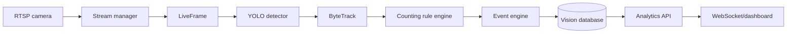

# AI Vision Production Architecture

The backend has one inference path:

`stream.LiveFrame` is the pipeline's input contract and rejects dataset, image,
snapshot, and cache sources. Snapshots remain presentation/evidence outputs only.

## Domain ownership

| Domain | Owns |
|---|---|
| `stream` | Live frame provenance and stream lifecycle |
| `detection` | YOLO adapter only |
| `tracking` | ByteTrack adapter and stable identities |
| `recognition` | Product recognition; Gemini only for unknowns |
| `rules` | Configurable count decision state machine |
| `events` | Approved event publication |
| `database` | Transactions and durable history |
| `analytics` | Read-only aggregations |
| `notifications` | Outbound delivery |
| `api` | HTTP/WebSocket transport |
| `utils` | Cross-cutting structured observability |

Dependencies point toward contracts and never back into the API. Detection and
tracking contain no counting decisions. Events cannot initiate inference.
